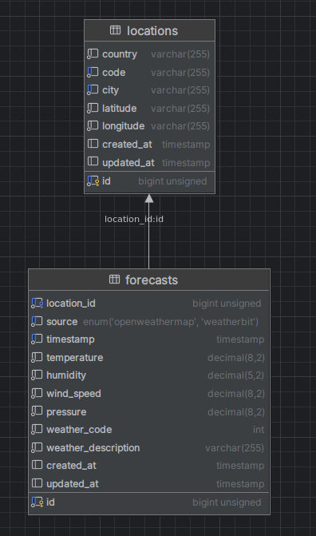

# Weather Forecast Application

## Description
A user can get forecast information based on city and location. <br>
The application will store the location details and the forecast data in the database.<br>
The forecast data will be retrieved from the OpenWeatherMap and WeatherBit APIs.<br>

## Setup

- clone the repository
- Composer install
```bash
composer install 
```
- i'm using [Laravel sail](https://laravel.com/docs/10.x/sail) so in case you want to use it run the command
```bash 
 ./vendor/bin/sail up -d
 ```
- run the migrations. I have some seed data from the testing that I did so you can run the seeders as well with the --seed.
```bash
php artisan migrate
```
```bash
php artisan migrate --seed
```


## Weather APIs used:
- https://www.weatherbit.io/api/weather-forecast-hourly
- https://openweathermap.org/forecast5#5days

## Database structure
Two simple database tables are used to store the locations and the forecasts.



```php
Schema::create('locations', function (Blueprint $table) {
            $table->id();
            $table->string('country');
            $table->string('code');
            $table->string('city');
            $table->string('latitude');
            $table->string('longitude');
            $table->timestamps();

            $table->unique(['code', 'city']);
        });

Schema::create('forecasts', function (Blueprint $table) {
            $table->id();
            $table->foreignId('location_id')->index()->constrained();
            $table->enum('source', ['openweathermap', 'weatherbit']);
            $table->timestamp('timestamp');
            $table->decimal('temperature');
            $table->decimal('humidity', 5);
            $table->decimal('wind_speed');
            $table->decimal('pressure');
            $table->integer('weather_code');
            $table->string('weather_description');
            $table->timestamps();

            $table->unique(['location_id', 'timestamp','source']);
        });
```

## API Reference

#### Creates location based on city
#### The api will call the OpenWeatherMap and try to find the location details based on city.

```http
  POST /api/city
```

| Parameter | Type     | Description                |
| :-------- | :------- | :------------------------- |
| `city` | `string` | **Required**. |

#### Create location based on coordinates
#### The api will call the OpenWeatherMap and try to find the location details based on coordinates.

```http
  POST /api/coordinates
```

| Parameter | Type     | Description                       |
| :-------- | :------- | :-------------------------------- |
| `lat`      | `decimal` | **Required**. |
| `lon`      | `decimal` | **Required**. |

#### Retrieving all the stored locations
```http
  GET /api/locations
```
Available Filters
- city
- code

#### Retrieving Forecast Data

```http
  GET /api/forecast
```
Available Filters
- city
- date
- lat&lon
- from_date

API examples to retrieve forecast data
```
/api/forecast?city=Limassol
/api/forecast?city=Limassol&date=2024-03-26
/api/forecast?lat=123&lon=123&from_date=2024-03-26&to_date<=2024-03-27
/api/forecast?lat=123&lon=123
```

## How to retrieve forecast data
- Make a Post request to **/api/city** or **/api/coordinates** to store the location details
- Make a Get request to **/api/forecast** to retrieve the forecast data

## Flowchart

#### Requesting a new Location
- The user can request a new location by providing the city name or the coordinates
- Trying to find the location details from the OpenWeatherMap API. If the location is found, it will be stored in the database
and then the Event will be dispatched to retrieve the forecast data
- The forecast data will be retrieved asynchronous from the Integrations that we have and stored in the database


#### Gathering Forecast Data
- Every one hour a scheduler will run to retrieve the forecast data for the locations that we have stored in the database.
- For each stored Location the Event will be dispatched to retrieve the forecast data
- In case of the forecast data is already stored in the database, the data will be updated


